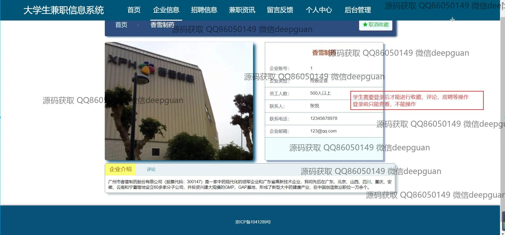
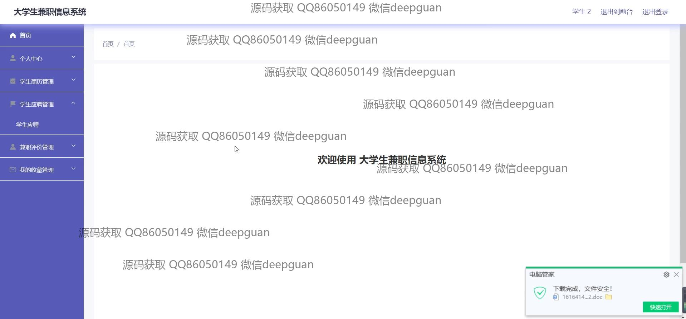

<h1 align="center">的大学生兼职信息系统vue</h1>

## 简介
大学生兼职信息系统：角色分为管理员、学生、企业用户；功能包括学生简历管理、企业信息管理、招聘信息管理、留言反馈、兼职评价管理，提升信息交互与管理效率。    --计算机毕业设计源码；毕设源码；java毕业设计源码

## 联系方式

<h3 align="center">获取完整代码与数据库文件 + 微信：deepguan QQ: 86050149 QQ群: 783742310</h3>

<h3 align="center">可帮忙远程部署 包运行成功！提供远程部署、修改代码、设计文档指导、代码讲解等服务！</h3>

## 功能介绍（完整见运行截图）
管理员：提供全面管理功能，包括用户登录、前后台切换、招聘审核及兼职评价管理。可以进行企业和学生信息的全局管理，管理功能模块包括学生管理、企业管理、招聘信息管理等。系统界面简洁直观，通过导航栏进行高效操作和审核学生兼职申请，确保系统高效、有序运行。

企业用户：可通过注册功能创建账号，进入系统后进行企业信息管理。主要功能包括企业信息录入与修改，如企业名称、类型、规模、联系人、联系方式及招聘岗位等。可以发布招聘信息、管理应聘的学生简历，审核评价，提升招聘效率。导航栏帮助企业方便快捷地进行信息和招聘管理。

学生用户：注册登录后可访问系统的个人中心，管理自己的简历信息和兼职申请。功能包括填写个人信息、上传头像、管理学生简历和兼职评价。可以搜索和浏览招聘信息，查看企业详情，轻松完成信息提交和申请，支持留言反馈以获取帮助和提升体验。

访客：可以浏览系统提供的兼职资讯和企业招聘信息，查看企业详情。未登录情况下仅具备查看权限，需注册登录后才能使用评论、收藏和应聘功能。留言反馈模块提供访客反馈入口，以便系统改进和更好服务潜在用户。整个界面设计简单明了，便于用户查找和了解相关信息。

## 运行截图

本代码来源于网络,仅供学习参考使用!

